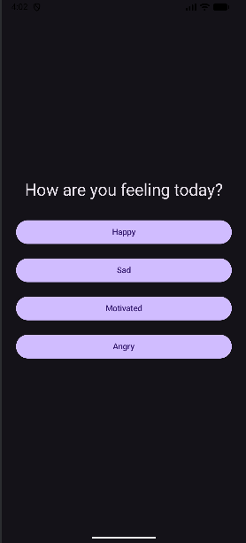
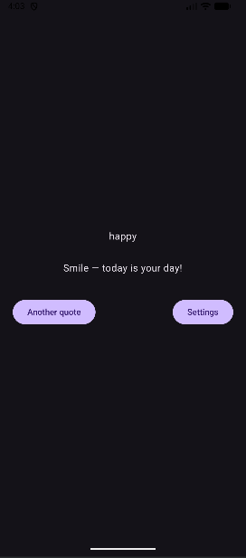
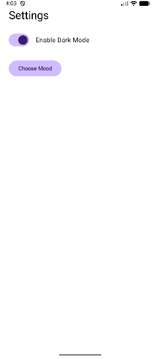

# BrightMotive

BrightMotive is an Android app that helps users track their mood and receive motivational quotes tailored to how they feel. Users can select their mood, get random motivational quotes, and enable dark mode for a better user experience.

## Features

- Mood selection screen with 4 moods: Happy, Sad, Motivated, Angry
- Motivation screen showing a random quote based on selected mood
- Home screen displaying last quote and mood
- Settings screen to enable/disable dark mode
- Another quote button to go through the moodselection and motivation pages again for a new quote or to change mood

## Tech Stack

- Android (Kotlin, Jetpack Compose)
- Architecture: MVVM
- Storage: DataStore / StateFlow
- Navigation: Compose Navigation
- Testing: JUnit / Espresso
### Some parts of this code were written with AI assistance. ###

## Screenshots

  
  
  

## How to Run
1. Clone the repo

2. Open in Android Studio

3. Run on an emulator or device (API 24+)

  

## License

MIT

